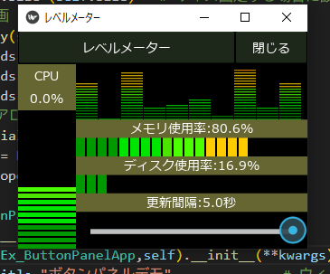
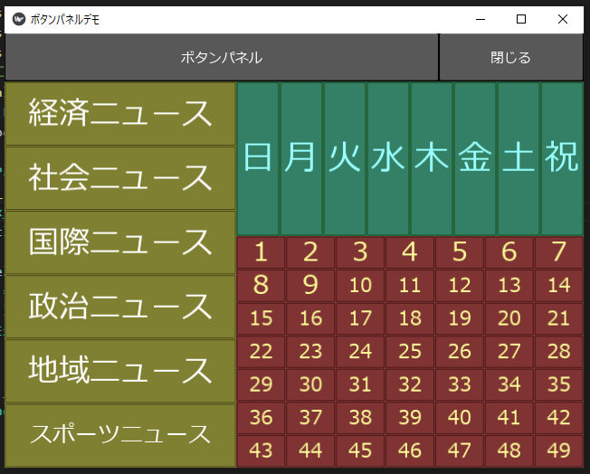
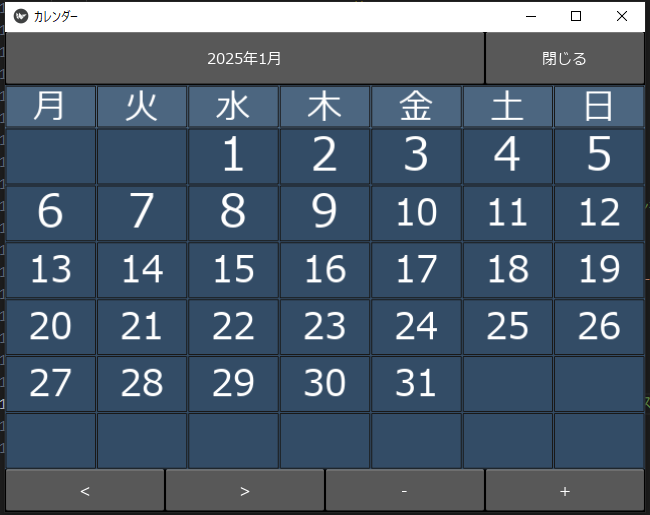
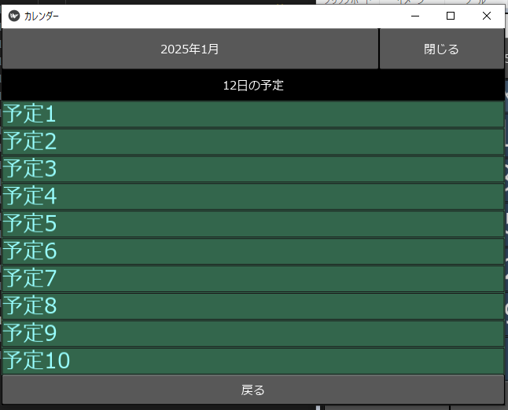
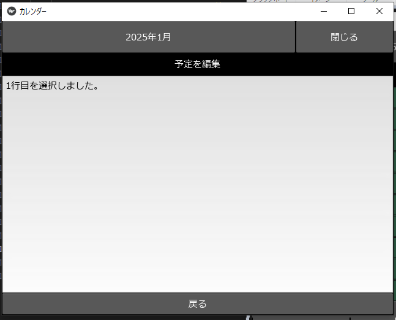

# KivyDaichamameUtils

## 履歴

2025年1月  新規作成

## 説明
Kivyで使用するために作成したモジュール

## モジュール詳細
### レベルメーター
#### ファイル構成
- kv
  - ex_levelmeterapp.kv     レベルメーターサンプルレイアウト
- lib
  - levelmeter.py         　レベルメーターモジュール
- ex_levelmeter.py          レベルメーターサンプル

#### 画面イメージ

### ボタンパネル
#### ファイル構成

- kv
  - ex_buttonpanelapp.kv  縦一列、横一列、縦7横7配列したボタン
  - ex_carousel.kv        カレンダー表記、リスト表記したサンプル
- lib
  - buttonpanel.py        ボタンパネルモジュール
- ex_buttonpanelapp.py    ボタン配列例
- ex_carousel.py          カレンダーのサンプル
#### 画面イメージ

